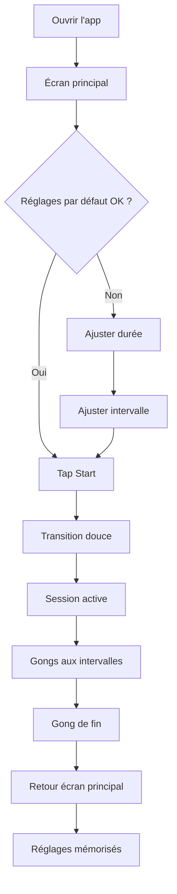
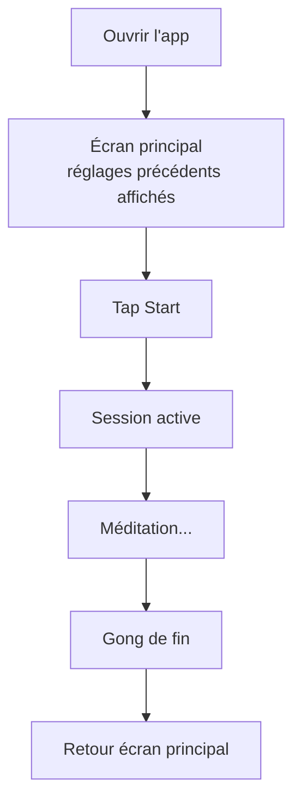
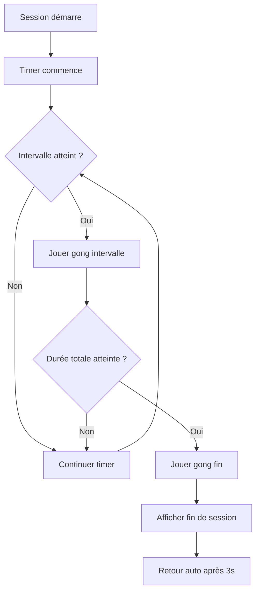
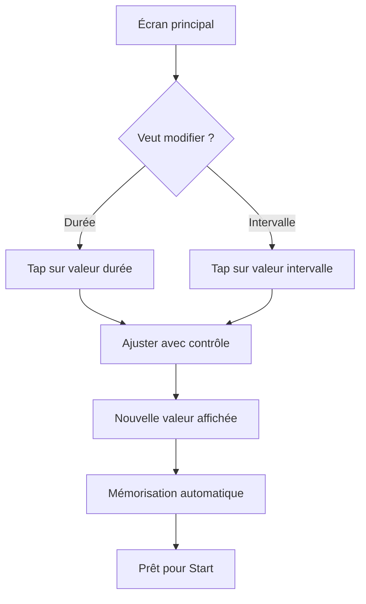

# UX Design Specification meditation

**Author:** Anna
**Date:** 2026-02-01

---

## Executive Summary

### Project Vision

**meditation** est un timer de méditation minimaliste conçu pour résoudre un problème précis : les timers standards (alarmes de téléphone, apps complexes) sont inadaptés à la pratique méditative. Ils génèrent du stress au lieu du calme, interrompent l'état méditatif, et ne permettent pas de suivre le temps sans ouvrir les yeux.

La solution : une PWA épurée qui permet de définir une durée et des intervalles, puis de méditer en confiance avec des sons de bol tibétain doux comme seuls repères temporels.

**Philosophie UX :** Simple = Parfait. Chaque élément d'interface doit servir la simplicité et le calme, jamais les complexifier.

### Target Users

**Persona principal : Anna**
- Pratiquante de méditation cherchant à approfondir sa pratique
- Médite 3x/semaine, 15-30 minutes, à domicile
- Frustrée par les timers inadaptés qui brisent son état de calme
- Recherche : fiabilité, simplicité, sons doux
- Critère de succès : "J'ai réussi à méditer dans le calme et en toute confiance"

**Niveau technique :** Intermédiaire - à l'aise avec les apps mobiles, pas besoin d'explications

**Contexte d'usage :** Mobile-first, moments calmes (matin/soir), environnement domestique

### Key Design Challenges

| Défi | Implication UX |
|------|----------------|
| **Simplicité extrême** | Interface si épurée qu'elle ne demande aucune réflexion - zéro charge cognitive |
| **Configuration rapide** | De l'ouverture au démarrage en < 10 secondes |
| **Atmosphère calme** | L'UI doit induire un état de calme avant même de méditer |
| **Contraintes audio mobile** | Politiques d'autoplay, contexte audio, fiabilité des sons |
| **Session sans interruption** | L'écran doit rester utilisable sans attirer l'attention |

### Design Opportunities

| Opportunité | Potentiel |
|-------------|-----------|
| **Interface "zen"** | Une esthétique minimaliste qui prépare mentalement à la méditation |
| **Micro-interactions apaisantes** | Animations douces et transitions fluides renforçant le calme |
| **Feedback minimal intelligent** | Informations essentielles présentées sans surcharge |
| **Ritualization** | L'app devient un rituel pré-méditation, un sas vers le calme |

## Core User Experience

### Defining Experience

**Action principale :** Ouvrir l'app et démarrer immédiatement avec les derniers réglages.

La méditation ne commence pas au premier gong - elle commence dès l'ouverture de l'app. L'expérience doit être si fluide que l'utilisateur passe de "je veux méditer" à "je médite" en quelques secondes, sans friction mentale.

**Boucle d'usage typique :**
1. Ouvrir l'app → réglages précédents affichés
2. Un tap sur Start
3. Méditer en confiance
4. Gong de fin → session terminée

### Platform Strategy

| Aspect | Décision |
|--------|----------|
| **Type** | Progressive Web App (PWA) |
| **Approche** | Mobile-first, offline-first |
| **Interaction** | Touch-based principalement |
| **Installation** | Installable sur écran d'accueil |
| **Connectivité** | 100% fonctionnel hors ligne après premier chargement |

### Effortless Interactions

| Interaction | Niveau d'effort cible |
|-------------|----------------------|
| **Ouvrir → Démarrer** | 1 tap (réglages déjà présents) |
| **Configuration initiale** | Intuitive, < 10 secondes |
| **Modifier les réglages** | Accessible mais pas intrusif |
| **Pendant la méditation** | Zéro interaction requise |
| **Fin de session** | Automatique, aucune action |

### Critical Success Moments

| Moment | Critère de succès |
|--------|-------------------|
| **Premier lancement** | "C'est exactement ce qu'il me faut" - clarté immédiate |
| **Premier gong** | Son doux qui maintient l'état méditatif |
| **Fin de session** | Calme préservé, confiance confirmée |
| **Usage quotidien** | L'app devient un rituel, pas un outil |

### Experience Principles

1. **Zéro friction** - De l'intention à l'action en un tap
2. **Configuration une fois, méditation toujours** - Les réglages persistent intelligemment
3. **Invisible quand active** - L'app travaille silencieusement pendant la méditation
4. **Calme du début à la fin** - Chaque pixel, chaque interaction respire la sérénité

## Desired Emotional Response

### Primary Emotional Goals

**Émotion principale :** Détente

L'app doit être un sas vers la relaxation. Dès l'ouverture, l'utilisateur commence à se détendre. L'interface elle-même participe à l'état méditatif recherché.

**Émotions secondaires :**
- **Confiance** - Savoir que l'app fera son travail sans faille
- **Simplicité** - Ne jamais avoir à réfléchir
- **Efficacité** - Atteindre son objectif sans détour

### Emotional Journey Mapping

| Phase | Émotion | Traduction UX |
|-------|---------|---------------|
| **Ouverture** | Apaisement | Interface calme, pas de sollicitation |
| **Configuration** | Clarté | Contrôles évidents, pas de surcharge |
| **Démarrage** | Confiance | Feedback clair, transition douce |
| **Session active** | Détente profonde | Écran minimal, aucune distraction |
| **Gong intervalle** | Douceur | Son qui accompagne, pas qui interrompt |
| **Fin de session** | Accomplissement | Conclusion sereine, pas de popup |
| **Après session** | Satisfaction | Fermeture simple, pas de rétention |

### Micro-Emotions

**À cultiver :**

| Micro-émotion | Importance |
|---------------|------------|
| **Confiance** vs Doute | L'utilisateur sait que les gongs arriveront |
| **Lâcher-prise** vs Contrôle | Pouvoir fermer les yeux sans inquiétude |
| **Accomplissement** vs Échec | Chaque session est une réussite |

**À éviter absolument :**

| Anti-émotion | Comment l'éviter |
|--------------|------------------|
| **Stress** | Pas de compte à rebours anxiogène |
| **Urgence** | Pas de notifications, pas de rappels |
| **Pression** | Pas d'historique, pas de "streak", pas de gamification |
| **Culpabilité** | Pas de jugement sur la fréquence d'usage |

### Design Implications

| Émotion cible | Implication UX |
|---------------|----------------|
| **Détente** | Palette de couleurs apaisantes, animations lentes et fluides |
| **Simplicité** | Maximum 2-3 éléments visibles à la fois |
| **Confiance** | Feedback subtil mais présent (timer visible) |
| **Efficacité** | Un tap pour démarrer, zéro étape superflue |

### Emotional Design Principles

1. **L'app est un refuge** - Chaque élément doit réduire le stress, jamais l'augmenter
2. **Invisible = Réussi** - Moins l'utilisateur pense à l'app, mieux c'est
3. **Zéro culpabilité** - Pas de tracking, pas de jugement, pas de "motivation"
4. **Simple = Efficace** - La simplicité EST la proposition de valeur émotionnelle

## UX Pattern Analysis & Inspiration

### Inspiring Products Analysis

**Approche choisie :** Design basé sur des principes plutôt que sur l'imitation d'apps existantes.

Les apps de méditation commerciales (Calm, Headspace, Insight Timer) offrent des fonctionnalités riches mais s'éloignent de la simplicité recherchée. L'inspiration pour **meditation** vient de principes de design minimaliste et d'interfaces "zen" plutôt que de produits spécifiques.

**Philosophie d'inspiration :**
- Moins c'est plus
- L'interface doit disparaître pendant l'usage
- Chaque élément doit justifier sa présence

### Transferable UX Patterns

**Patterns à Adopter :**

| Pattern | Application pour meditation |
|---------|----------------------------|
| **Single-screen app** | Tout sur un seul écran - configuration, démarrage, timer |
| **Progressive disclosure** | Réglages accessibles mais pas imposés |
| **Ambient interface** | Couleurs et formes apaisantes, non-stimulantes |
| **Generous whitespace** | Espace vide généreux = espace mental pour respirer |
| **Large touch targets** | Boutons faciles à toucher, même les yeux mi-clos |
| **Persistent state** | Derniers réglages mémorisés automatiquement |
| **Minimal chrome** | Pas de barre de navigation, pas de menu hamburger |

**Interactions clés :**

| Interaction | Pattern recommandé |
|-------------|-------------------|
| **Sélection durée** | Slider ou stepper simple, pas de clavier |
| **Sélection intervalle** | Même pattern que durée, cohérence |
| **Démarrage** | Bouton central proéminent, un seul tap |
| **Arrêt session** | Accessible mais pas accidentel |

### Anti-Patterns to Avoid

**Ce que font les apps commerciales (à ne pas reproduire) :**

| Anti-pattern | Effet négatif | Alternative pour meditation |
|--------------|---------------|----------------------------|
| **Onboarding interminable** | Friction, impatience | Aucun onboarding - usage immédiat |
| **Écran d'accueil chargé** | Surcharge cognitive | Écran unique, épuré |
| **Gamification** | Pression, performance | Zéro tracking, zéro streak |
| **Notifications push** | Culpabilité | Aucune notification |
| **Historique/statistiques** | Jugement implicite | Pas de données conservées |
| **Upselling/premium** | Stress commercial | App gratuite, complète |
| **Compte utilisateur** | Friction, vie privée | Pas de compte requis |
| **Contenu guidé** | Dépendance, complexité | Timer pur, liberté totale |

### Design Inspiration Strategy

**Principes directeurs :**

1. **Adopter** - Patterns minimalistes éprouvés
   - Single-screen design
   - Large touch targets
   - Persistent state
   - Ambient colors

2. **Adapter** - Simplifier au maximum
   - Contrôles de timer standards → version ultra-simplifiée
   - Feedback visuel → minimal mais présent

3. **Rejeter** - Tout ce qui ajoute de la friction ou de la pression
   - Onboarding
   - Tracking
   - Gamification
   - Notifications
   - Comptes utilisateur

**Résultat visé :** Une app si simple qu'elle semble évidente, comme si elle n'avait pas pu être conçue autrement.

## Design System Foundation

### Design System Choice

**Choix :** Tailwind CSS personnalisé (sans framework de composants)

Une approche légère et sur-mesure, parfaitement adaptée à une app single-screen minimaliste.

### Rationale for Selection

| Critère | Justification |
|---------|---------------|
| **Simplicité de l'app** | Très peu de composants nécessaires - un design system complet serait excessif |
| **Contrôle esthétique** | Tailwind permet de créer l'atmosphère "zen" exacte souhaitée |
| **Performance** | Aucune dépendance lourde, bundle minimal pour la PWA |
| **Flexibilité** | Pas de "look" prédéfini à combattre ou personnaliser |
| **Maintenance** | Code simple, facile à maintenir pour un projet solo |

### Implementation Approach

**Stack technique :**
- **Tailwind CSS** - Utilitaires de style
- **CSS custom properties** - Variables pour les couleurs et espacements clés
- **Composants React simples** - Sans bibliothèque de composants externe

**Composants à créer :**

| Composant | Description |
|-----------|-------------|
| **TimerDisplay** | Affichage du temps (durée/écoulé) |
| **DurationSelector** | Sélection de la durée totale |
| **IntervalSelector** | Sélection de l'intervalle entre gongs |
| **StartButton** | Bouton de démarrage principal |
| **StopButton** | Bouton d'arrêt (pendant session) |

### Customization Strategy

**Design tokens à définir :**

| Catégorie | Tokens |
|-----------|--------|
| **Colors** | background, surface, text-primary, text-secondary, accent |
| **Spacing** | generous (marges larges), comfortable (entre éléments) |
| **Typography** | timer (grande, lisible), label (petite, discrète) |
| **Animation** | duration: slow, easing: ease-out |

**Principes de customisation :**
1. Palette de couleurs apaisantes (tons neutres, peu de contraste agressif)
2. Typographie claire et lisible
3. Animations lentes et fluides
4. Espacement généreux (breathing room)

## Defining User Experience

### Defining Experience

**L'expérience définissante :** "Un tap, et je médite en confiance."

**Pitch en une phrase :** Méditer en pleine conscience de façon autonome et simple.

L'app se résume à cette promesse : l'utilisateur ouvre, appuie, et peut fermer les yeux en toute confiance. Les gongs doux marquent le temps sans jamais interrompre l'état méditatif.

### User Mental Model

**Comment les utilisateurs résolvent ce problème aujourd'hui :**
- Timer du téléphone → alarme stressante, pas d'intervalles
- Apps de méditation → trop complexes, contenu imposé, abonnements
- Montre/horloge → obligation d'ouvrir les yeux

**Modèle mental attendu :**
- "Je configure une fois, j'utilise toujours"
- "L'app fait son travail silencieusement"
- "Je n'ai pas à m'inquiéter du temps"

**Ce qui frustre avec les solutions existantes :**
- Alarmes agressives qui brisent le calme
- Trop d'étapes avant de pouvoir commencer
- Fonctionnalités inutiles qui encombrent

### Success Criteria

| Critère | Indicateur de succès |
|---------|---------------------|
| **Son du gong** | Doux et non-intrusif, maintient l'état méditatif |
| **Confiance** | L'utilisateur peut fermer les yeux sans inquiétude |
| **Rapidité** | Du lancement au Start en < 5 secondes (usage quotidien) |
| **Fiabilité** | 100% des gongs au bon moment, zéro crash |
| **Autonomie** | Aucune dépendance à un compte, contenu ou connexion |

**Le test ultime :** L'utilisateur termine sa session et pense "c'était bien" - pas "l'app a bien fonctionné". L'app est invisible.

### Novel UX Patterns

**Analyse :** Patterns établis, exécution soignée.

L'app n'invente rien de nouveau - elle combine des patterns familiers (timer, bouton start, sons) de façon exceptionnellement simple et adaptée à la méditation.

| Aspect | Pattern utilisé |
|--------|-----------------|
| **Configuration** | Sliders/steppers standards |
| **Démarrage** | Bouton central proéminent |
| **Timer** | Affichage temps classique |
| **Audio** | Sons déclenchés par timer |

**Innovation :** L'innovation n'est pas dans l'interaction mais dans la philosophie - faire MOINS, pas plus. Retirer tout ce qui n'est pas essentiel.

### Experience Mechanics

**1. Initiation :**
- L'utilisateur ouvre l'app
- Les derniers réglages sont déjà affichés
- Le bouton Start est immédiatement visible et accessible

**2. Interaction :**
- Optionnel : ajuster durée/intervalle (sliders ou steppers)
- Un tap sur Start
- Transition douce vers l'écran de session

**3. Feedback pendant la session :**
- Timer visible (temps écoulé ou restant)
- Gong d'intervalle doux aux moments configurés
- Aucune autre sollicitation

**4. Completion :**
- Gong de fin distinct mais doux
- L'écran indique la fin de session
- Retour automatique à l'écran principal (prêt pour la prochaine session)

## Visual Design Foundation

### Color System

**Direction choisie :** Tons froids apaisants (thème clair unique)

**Palette principale :**

| Token | Couleur | Usage |
|-------|---------|-------|
| `background` | Bleu-gris très pâle (#F5F7F9) | Fond principal |
| `surface` | Blanc légèrement bleuté (#FAFBFC) | Cartes, zones surélevées |
| `text-primary` | Gris anthracite (#2D3748) | Texte principal, timer |
| `text-secondary` | Gris moyen (#718096) | Labels, texte secondaire |
| `accent` | Bleu océan doux (#5A8F9A) | Bouton Start, éléments interactifs |
| `accent-hover` | Bleu océan plus foncé (#4A7A84) | États hover/pressed |

**Sensation visée :** Frais, serein, espacé - comme un ciel clair au petit matin.

**Principes couleur :**
- Faible contraste global pour éviter la fatigue visuelle
- Accent utilisé avec parcimonie (bouton Start uniquement)
- Pas de couleurs vives ou saturées

### Typography System

**Direction choisie :** Classique et élégante (style "spa")

**Police principale :** Serif moderne (ex: Playfair Display, Cormorant, ou Libre Baskerville)
- Usage : Timer, titres

**Police secondaire :** Sans-serif épurée (ex: Inter, Source Sans Pro)
- Usage : Labels, texte utilitaire

**Échelle typographique :**

| Élément | Taille | Poids | Usage |
|---------|--------|-------|-------|
| `timer` | 48-64px | Light (300) | Affichage temps principal |
| `label` | 14-16px | Regular (400) | "Durée", "Intervalle" |
| `value` | 20-24px | Medium (500) | Valeurs configurées |
| `button` | 18px | Medium (500) | Texte bouton Start |

**Principes typographiques :**
- Timer très lisible, même à distance
- Hiérarchie claire : timer > valeurs > labels
- Élégance sans préciosité

### Spacing & Layout Foundation

**Philosophie :** Generous whitespace - l'espace vide est un élément de design.

**Unité de base :** 8px

**Échelle d'espacement :**

| Token | Valeur | Usage |
|-------|--------|-------|
| `xs` | 4px | Micro-espacements |
| `sm` | 8px | Entre label et valeur |
| `md` | 16px | Entre éléments liés |
| `lg` | 32px | Entre sections |
| `xl` | 48px | Marges extérieures |
| `2xl` | 64px | Espacement vertical majeur |

**Layout :**
- Single-screen, centré verticalement
- Marges latérales généreuses (minimum 24px mobile)
- Contenu groupé au centre avec espace autour
- Bouton Start proéminent en bas de zone

**Principes layout :**
1. L'espace vide domine - le contenu "flotte"
2. Centrage vertical pour focus naturel
3. Touch targets minimum 48x48px

### Accessibility Considerations

**Niveau cible :** WCAG 2.1 AA (base)

| Aspect | Approche |
|--------|----------|
| **Contraste** | Ratio minimum 4.5:1 pour texte, 3:1 pour éléments UI |
| **Taille de texte** | Minimum 16px pour texte courant |
| **Touch targets** | Minimum 48x48px pour tous les éléments interactifs |
| **Focus visible** | Outline visible pour navigation clavier |

**Note :** L'accessibilité avancée (lecteurs d'écran) n'est pas une priorité MVP mais le design ne doit pas l'empêcher.

## Design Direction Decision

### Design Directions Explored

Six directions visuelles ont été explorées :

| Direction | Approche | Verdict |
|-----------|----------|---------|
| A - Centered Minimal | Timer dominant, config verticale | Fonctionnel mais classique |
| B - Card-based | Configuration en cartes | Trop structuré |
| **C - Circular Focus** | Timer circulaire, bouton rond | **Choisi** - Zen et centré |
| D - Stepper Controls | Boutons +/- | Contrôle précis mais plus d'éléments |
| E - Ultra Minimal | Config en ligne | Peut-être trop minimal |
| F - Session View | Vue active avec progression | Référence pour l'écran de session |

### Chosen Direction

**Direction C - Circular Focus**

Caractéristiques clés :
- Timer affiché dans un cercle central (focal point naturel)
- Configuration en dessous, discrète mais accessible
- Bouton Start circulaire proéminent
- Composition symétrique et équilibrée
- Espace généreux autour des éléments

### Design Rationale

| Aspect | Justification |
|--------|---------------|
| **Cercle central** | Forme méditative par excellence, invite à la contemplation |
| **Bouton Start rond** | Cohérence visuelle, cible facile à toucher |
| **Symétrie** | Équilibre visuel = équilibre mental |
| **Hiérarchie claire** | Timer > Start > Config |
| **Espace vide** | Respiration visuelle, calme |

### Implementation Approach

**Écran principal (configuration) :**
- Cercle contenant le timer (durée configurée)
- Deux valeurs de configuration en dessous (durée + intervalle)
- Grand bouton Start circulaire

**Écran session (pendant méditation) :**
- Même cercle avec temps écoulé/restant
- Indicateurs de gongs passés (points)
- Bouton Arrêter discret

**Transitions :**
- Animation douce du cercle au démarrage
- Fade subtil entre les états

## User Journey Flows

### Premier Lancement

**Contexte :** Anna ouvre l'app pour la première fois.

**Objectif :** Configurer et démarrer sa première session en moins de 30 secondes.



**Étapes détaillées :**

| Étape | Action utilisateur | Feedback système |
|-------|-------------------|------------------|
| 1 | Ouvre l'app | Écran principal avec valeurs par défaut (20 min, 5 min) |
| 2 | Optionnel : ajuste durée | Valeur mise à jour en temps réel |
| 3 | Optionnel : ajuste intervalle | Valeur mise à jour en temps réel |
| 4 | Tap sur Start | Animation de transition |
| 5 | Ferme les yeux | Timer démarre, écran session |
| 6 | Attend | Gong d'intervalle aux moments configurés |
| 7 | Attend | Gong de fin distinct |
| 8 | Ouvre les yeux | Écran indique fin, retour auto à l'accueil |

### Usage Quotidien

**Contexte :** Anna utilise l'app régulièrement, ses réglages sont mémorisés.

**Objectif :** Démarrer en moins de 5 secondes.



**Temps cible :** 2-3 secondes entre ouverture et Start.

### Session Active

**Contexte :** L'utilisateur médite, l'app travaille silencieusement.

**Objectif :** Zéro interaction requise, feedback audio uniquement.



**Feedback pendant session :**

| Élément | Visibilité | Raison |
|---------|------------|--------|
| Timer (temps écoulé) | Visible mais discret | Repère si l'utilisateur ouvre les yeux |
| Indicateurs de gongs | Optionnel (points) | Savoir où on en est |
| Bouton Arrêter | Visible mais discret | Urgence uniquement |

### Modification des Réglages

**Contexte :** L'utilisateur veut changer sa configuration.

**Objectif :** Modification intuitive, sans mode édition séparé.



**Interaction de modification :**
- Tap sur la valeur pour sélectionner
- Glisser ou boutons +/- pour ajuster
- Validation automatique (pas de bouton "Sauvegarder")

### Journey Patterns

**Patterns communs identifiés :**

| Pattern | Description | Usage |
|---------|-------------|-------|
| **Zéro confirmation** | Actions immédiates, pas de "Êtes-vous sûr ?" | Start, modification |
| **Mémorisation silencieuse** | État sauvegardé automatiquement | Réglages |
| **Retour automatique** | Transitions sans action requise | Fin de session |
| **Feedback audio-first** | Son = signal principal, visuel = secondaire | Gongs |

### Flow Optimization Principles

1. **Minimiser les taps** - Idéalement 1 tap pour l'usage quotidien
2. **Pas de modes** - Tout sur le même écran, pas d'écran de configuration séparé
3. **Feedback immédiat** - Chaque action a une réponse visuelle instantanée
4. **Graceful degradation** - Si audio échoue, feedback visuel de secours
5. **État persistant** - L'app se souvient de tout, l'utilisateur ne configure rien deux fois

## Component Strategy

### Inventaire des Composants

L'architecture "Direction C - Circular Focus" requiert les composants suivants :

| Composant | Fonction | Priorité |
|-----------|----------|----------|
| **CircularProgress** | Timer visuel central avec cercle de progression | Critique |
| **DurationSelector** | Configuration de la durée totale | Critique |
| **IntervalSelector** | Configuration de l'intervalle entre gongs | Critique |
| **StartButton** | Démarrage de la session | Critique |
| **StopButton** | Arrêt de la session en cours | Critique |
| **GongIndicators** | Points visuels indiquant les gongs passés/restants | Secondaire |

### Hiérarchie Visuelle

```
┌─────────────────────────────────┐
│                                 │
│   ┌───────────────────────┐     │
│   │                       │     │
│   │   CircularProgress    │     │
│   │   (élément dominant)  │     │
│   │                       │     │
│   └───────────────────────┘     │
│                                 │
│   ┌───────┐     ┌───────┐       │
│   │Duration│     │Interval│      │
│   │Selector│     │Selector│      │
│   └───────┘     └───────┘       │
│                                 │
│        ┌───────────┐            │
│        │  START    │            │
│        └───────────┘            │
│                                 │
└─────────────────────────────────┘
```

### Comportements des Composants

**CircularProgress**
- État repos : cercle complet, couleur neutre
- État actif : cercle se "vide" progressivement (sens horaire)
- Affichage du temps : MM:SS au centre
- Animation fluide (60fps) pour progression continue

**DurationSelector / IntervalSelector**
- Interaction : tap pour sélectionner, glisser ou +/- pour ajuster
- Valeurs prédéfinies : 5, 10, 15, 20, 30, 45, 60 min (durée)
- Valeurs prédéfinies : 1, 2, 3, 5, 10 min (intervalle)
- Validation automatique, pas de bouton "OK"

**StartButton**
- État repos : proéminent, couleur d'accent, label "Start"
- Transition vers StopButton pendant session
- Zone de tap généreuse (min 48x48px)

**StopButton**
- Visible pendant session, mais discret
- Couleur neutre, pas rouge/alarmant
- Confirmation non requise (session peut être relancée)

**GongIndicators**
- Points alignés horizontalement sous le timer
- Point rempli = gong passé
- Point vide = gong à venir
- Animation subtile au moment du gong

### Décisions d'Implémentation

| Décision | Choix | Raison |
|----------|-------|--------|
| **Bibliothèque UI** | Tailwind CSS custom | Contrôle total, bundle minimal |
| **Composants** | React components natifs | Simplicité, pas de dépendances |
| **Animations** | CSS transitions + requestAnimationFrame | Performance optimale |
| **Sons** | Web Audio API | Fiabilité, contrôle précis |

## UX Consistency Patterns

### Hiérarchie des Boutons

**Principes :**
- Un seul bouton d'action principale visible à la fois
- Pas de hiérarchie complexe (pas de primaire/secondaire/tertiaire)

| État | Bouton Visible | Style |
|------|----------------|-------|
| **Repos** | Start | Proéminent, couleur d'accent, centré |
| **Session active** | Stop | Discret, couleur neutre, même position |

**Règles :**
- Zone de tap minimum : 48x48px (accessibilité)
- Feedback tactile : changement de couleur immédiat au tap
- Pas de bouton "Annuler" ou "Retour" - l'app n'a qu'un écran

### Patterns de Feedback

**Audio (priorité principale) :**

| Événement | Son | Volume |
|-----------|-----|--------|
| Gong d'intervalle | Bol tibétain (2-3s) | Moyen, non intrusif |
| Gong de fin | Bol tibétain distinct (4-5s) | Légèrement plus fort |
| Erreur audio | Fallback visuel | N/A |

**Visuel (support secondaire) :**

| Feedback | Comportement |
|----------|--------------|
| Tap sur bouton | Changement de couleur instantané |
| Démarrage session | Timer commence à décompter |
| Gong passé | Point indicateur se remplit |
| Fin de session | Timer affiche 00:00, retour auto après 3s |

**Fallback en cas d'erreur audio :**
- Flash visuel subtil sur le cercle du timer
- Notification discrète "Son indisponible"

### Patterns de Sélection

**Sélecteurs de durée/intervalle :**

| Aspect | Comportement |
|--------|--------------|
| Interaction | Tap pour focus, glisser ou +/- pour ajuster |
| Validation | Automatique, pas de bouton "OK" |
| Valeurs | Prédéfinies, pas de saisie libre |
| Mémorisation | Dernière valeur sauvegardée automatiquement |

**Contraintes intelligentes :**
- Intervalle ne peut pas dépasser la durée totale
- Si durée < intervalle actuel, intervalle s'ajuste automatiquement

### Patterns d'États

| État | Indicateurs Visuels |
|------|---------------------|
| **Repos** | Timer à 00:00, bouton Start visible, sélecteurs actifs |
| **Session active** | Timer décompte, cercle se vide, bouton Stop visible, sélecteurs désactivés |
| **Gong en cours** | Animation subtile sur le cercle, point indicateur se remplit |
| **Fin de session** | Timer à 00:00, pause de 3s, retour automatique à Repos |

### Patterns de Persistance

| Donnée | Stockage | Comportement |
|--------|----------|--------------|
| Durée configurée | LocalStorage | Restaurée au lancement |
| Intervalle configuré | LocalStorage | Restauré au lancement |
| Session en cours | Aucun | Perdue si app fermée |

**Règle :** Pas de sauvegarde d'historique par design - l'app ne juge pas, ne compte pas, ne gamifie pas.

### Mobile-First Patterns

| Pattern | Implémentation |
|---------|----------------|
| Touch targets | Min 48x48px, espacement 8px entre éléments |
| Orientation | Portrait uniquement (verrouillé si possible) |
| Wake Lock | Écran reste allumé pendant session |
| Audio context | Initialisé au tap Start pour contourner autoplay policies |

## Responsive Design & Accessibility

### Responsive Strategy

**Approche : Mobile-First**

L'app est conçue principalement pour mobile. Les adaptations desktop sont fonctionnelles mais non prioritaires.

| Appareil | Stratégie |
|----------|-----------|
| **Mobile** | Design principal - cercle timer centré, boutons généreux |
| **Tablet** | Mise à l'échelle proportionnelle, plus d'espace autour du timer |
| **Desktop** | Conteneur centré avec largeur max, pas de fonctionnalités supplémentaires |

**Philosophie :** L'interface ne change pas fondamentalement entre les tailles d'écran - elle respire simplement différemment.

### Breakpoint Strategy

| Breakpoint | Largeur | Adaptations |
|------------|---------|-------------|
| **Mobile** | < 768px | Design principal, pleine largeur |
| **Tablet** | 768px - 1024px | Padding augmenté, timer légèrement plus grand |
| **Desktop** | > 1024px | max-width: 480px centré, effet "app mobile sur desktop" |

**Approche Mobile-First :**
```css
/* Base = mobile */
.timer { width: 280px; }

/* Tablet et plus */
@media (min-width: 768px) {
  .timer { width: 320px; }
}

/* Desktop - conteneur limité */
@media (min-width: 1024px) {
  .container { max-width: 480px; margin: 0 auto; }
}
```

### Accessibility Strategy

**Niveau visé : WCAG 2.1 AA (baseline)**

| Critère | Implémentation |
|---------|----------------|
| **Contrastes** | Ratio minimum 4.5:1 pour texte, 3:1 pour éléments UI |
| **Touch targets** | Minimum 48x48px avec espacement 8px |
| **Focus visible** | Outline visible sur tous les éléments interactifs |
| **Texte redimensionnable** | Unités rem, support zoom 200% |

**Considérations spécifiques pour meditation :**

| Aspect | Décision | Raison |
|--------|----------|--------|
| **Lecteurs d'écran** | Support basique (labels, annonces) | Usage principal = yeux fermés, pas de navigation complexe |
| **Réduction de mouvement** | Respecter `prefers-reduced-motion` | Animations du cercle optionnelles |
| **Mode sombre** | Non prévu MVP | Thème clair unique pour simplicité |

**Éléments accessibles :**
- `aria-label` sur boutons Start/Stop
- `aria-live="polite"` pour annonces de temps (optionnel)
- Sémantique HTML correcte (`<button>`, `<time>`)

### Testing Strategy

**Tests Responsive :**

| Test | Méthode |
|------|---------|
| Emulateur | Chrome DevTools device mode |
| Appareils réels | iPhone, Android (prioritaire) |
| Orientations | Portrait uniquement (recommandé verrouillé) |

**Tests Accessibilité :**

| Test | Outil |
|------|-------|
| Contrastes automatiques | axe DevTools, Lighthouse |
| Navigation clavier | Test manuel |
| Lecteur d'écran | VoiceOver (iOS), TalkBack (Android) - basique |

**Critères de validation :**
- Lighthouse Accessibility score > 90
- Tous les éléments interactifs accessibles au clavier
- Contrastes conformes AA

### Implementation Guidelines

**Responsive :**
- Utiliser `rem` pour les tailles de texte (base 16px)
- `%` ou `vw/vh` pour les dimensions du timer
- Flexbox pour le centrage vertical/horizontal
- Pas de media queries complexes - l'app est simple

**Accessibilité :**
```html
<!-- Exemple de markup accessible -->
<button
  aria-label="Démarrer la méditation"
  class="start-button">
  Start
</button>

<div
  role="timer"
  aria-live="off"
  aria-label="Temps écoulé">
  <time>05:00</time>
</div>
```

**Règles clés :**
- Jamais `outline: none` sans alternative visible
- Tous les boutons sont des `<button>`, pas des `<div>`
- `prefers-reduced-motion: reduce` → désactiver animations non essentielles

